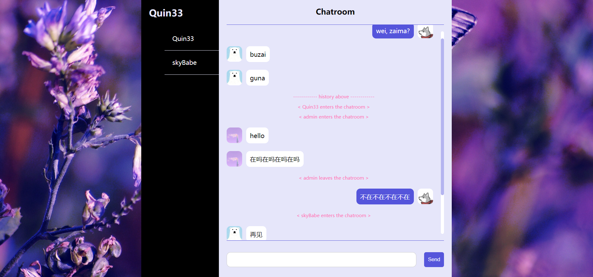

# 在线聊天室 Chatroom
用于学习实时通信聊天库[socket.io](https://socket.io/)

## 技术栈
koa + socket.io

## 功能实现
1. 登录界面
   
2. 聊天室界面
   
   支持：
   - 在线用户列表
   - 聊天信息发送
   - 聊天信息接收
   - 聊天历史记录

TODO：
- 用户信息、聊天历史记录本地化存储
- 添加CSS动画效果
- 登录密码传输加密/HTTPS

## 运行
### 服务器端
打开项目根目录，运行服务器端程序`server.js` 
``` sh
npm start
```
### 客户端
浏览器访问http://127.0.0.1:3000/，多个客户端访问查看效果

#### 登录
默认提供账号
``` js
{
    "admin":"123456",
    "Quin33":"Quin33",
    "skyBabe":"skyBabe",
    "erduoG":"erduoG",
}
```

## 知识点
